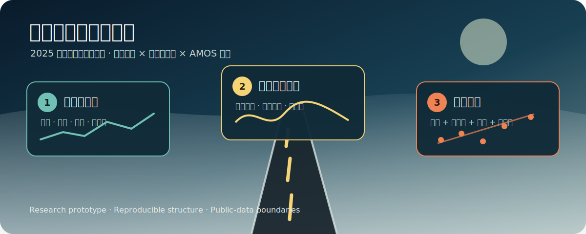
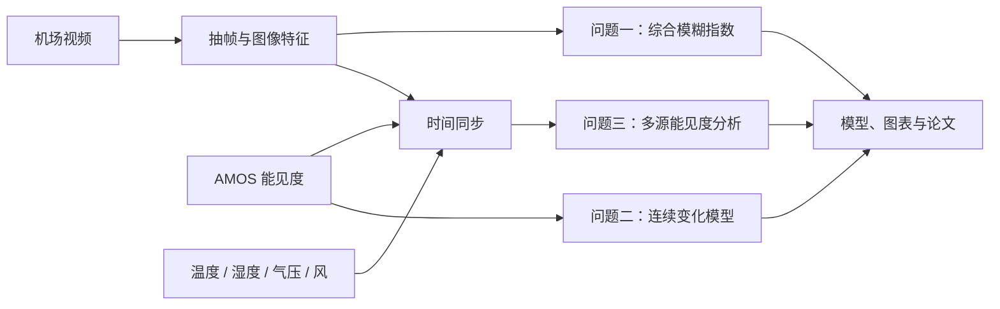
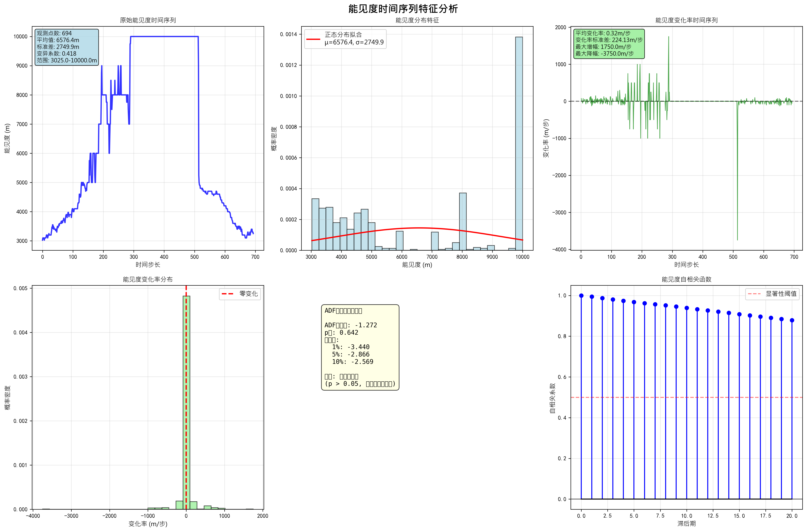
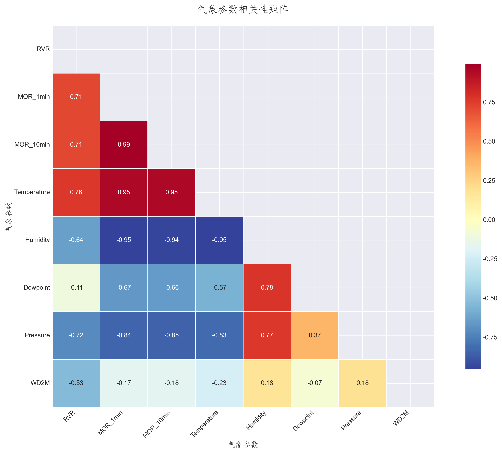

<p align="center">
  
</p>

# 雾天机场能见度建模

这是 2025 年江西省数学建模竞赛“基于大雾背景视频学习的能见度回归建模”参赛项目的开源整理版。项目用跑道视频图像特征与自动气象观测系统（AMOS）数据，串联图像模糊度量化、能见度连续变化建模和多源回归分析三项任务。

> **项目状态**：竞赛研究原型。代码与历史结果适合学习、复现和继续研究，不是经过航空业务认证的运行系统，不能替代能见度仪、气象观测规范或机场安全决策。

## 研究内容

| 任务 | 核心问题 | 推荐入口 | 主要方法 |
| --- | --- | --- | --- |
| 问题一 | 如何量化大雾导致的视频模糊？ | [`question1_video_features.py`](src/question1_video_features.py)、[`question1_blur_regression.py`](src/question1_blur_regression.py) | 抽帧、Laplacian/Sobel、频域与对比度特征、综合模糊指数、二次多项式岭回归 |
| 问题二 | 如何描述能见度随时间的连续变化？ | [`question2_continuous_visibility.py`](src/question2_continuous_visibility.py) | 时间序列分析、状态空间模型、微分方程、非线性动力学与模型比较 |
| 问题三 | 如何融合图像与气象要素估计能见度？ | [`question3_visibility_analysis.py`](src/question3_visibility_analysis.py) | 图像特征、温湿压、风场与能见度的相关性、分布和异常值分析 |



更完整的题意概述见 [`docs/problem-summary.md`](docs/problem-summary.md)，参赛论文草稿见 [`docs/paper.md`](docs/paper.md)。

## 结果快照

下面是比赛期间保存的代表性输出。它们对应当时的数据、代码与切分方式，主要用于展示分析流程；公开引用指标前应重新运行并记录随机种子。

<p align="center">
  
</p>

<p align="center"><em>问题二：694 个观测点的时间序列、变化率、ADF 检验与自相关快照</em></p>

<p align="center">
  
</p>

<p align="center"><em>探索性分析：能见度与主要气象要素的相关结构</em></p>

更多图表和文本报告见 [`results/`](results/README.md)。论文草稿中的部分参数含比赛期间的示例或待复核表述，不在此 README 中作为已验证结论重复引用。

## 快速开始

要求 Python 3.10 或更高版本。建议使用独立虚拟环境：

```bash
git clone https://github.com/Nanqipro/jx-mcm-2025.git
cd jx-mcm-2025

python -m venv .venv
source .venv/bin/activate        # Windows: .venv\Scripts\activate
python -m pip install -r requirements.txt
```

先生成不含竞赛原始记录的合成演示数据：

```bash
python scripts/generate_demo_data.py
```

然后分别运行三个可无视频执行的流程：

```bash
# 问题一：模糊指数回归
python src/question1_blur_regression.py --data data/demo/blur.csv

# 问题二：能见度连续变化建模，图表写入 results/generated/
python src/question2_continuous_visibility.py --data data/demo/blur.csv

# 问题三：图像、气象与能见度关系分析
python src/question3_visibility_analysis.py --data data/demo/complete_synced_data.csv
```

合成数据只验证流程和字段兼容性，不能复现参赛论文指标。服务器或 CI 环境可设置 `MPLBACKEND=Agg` 关闭交互式图窗。

### 使用自己的视频

```bash
python src/question1_video_features.py \
  --video /path/to/foggy-runway.mp4 \
  --interval 60 \
  --output results/generated/video-features.csv
```

脚本支持按帧号或时间戳跳转抽帧；运行 `python src/question1_video_features.py --help` 查看参数。

### 使用获授权的竞赛数据

将数据放入 Git 已忽略的 `data/private/`，默认约定和字段表见 [`data/README.md`](data/README.md)。原始数据、机场视频、题面全文和行业标准不随本仓库再发布。

## 仓库结构

```text
.
├── src/                         # 四个推荐入口与探索脚本
│   └── experiments/             # 比赛期间的早期/替代实现
├── scripts/                     # 合成演示数据生成器
├── tests/                       # 不依赖竞赛私有数据的轻量测试
├── notebooks/                   # 按三问整理的原始 Notebook
├── data/                        # 数据规范；private/ 与 demo/ 不提交
├── docs/                        # 题意摘要、论文与建模笔记
├── results/                     # 人工挑选的历史结果快照
├── requirements.txt
└── LICENSE
```

代码入口和探索脚本的关系见 [`src/README.md`](src/README.md)。

## 复现与验证

```bash
python -m unittest discover -s tests -v
python -m compileall -q src scripts tests
```

当前开源版保留了竞赛迭代痕迹：探索脚本之间有功能重叠，Notebook 主要是代码单元，部分模型未统一固定随机种子。若用于正式研究，建议先统一数据版本、时间切分、特征定义和评价协议，再报告性能。

## 数据、版权与安全边界

- MIT 许可证仅覆盖参赛者编写的源代码和本仓库原创文档；
- 竞赛题面、原始 AMOS 数据、机场视频、行业标准和外部论文仍归各自权利人所有；
- 公开可见不等同于获得第三方数据或内容的再分发许可；
- 本项目输出不得直接用于航班放行、跑道运行或其他安全关键决策。

如果你拥有数据再发布授权，可在 Pull Request 中附上来源、许可文本与可公开范围。

## 参与贡献

欢迎修复路径、补充测试、统一模型评价或将探索脚本重构为可复用模块。提交前请阅读 [`CONTRIBUTING.md`](CONTRIBUTING.md)。

## 许可证

参赛者原创代码与原创文档采用 [MIT License](LICENSE)。第三方材料不因本仓库使用 MIT 许可证而改变其权利归属。
